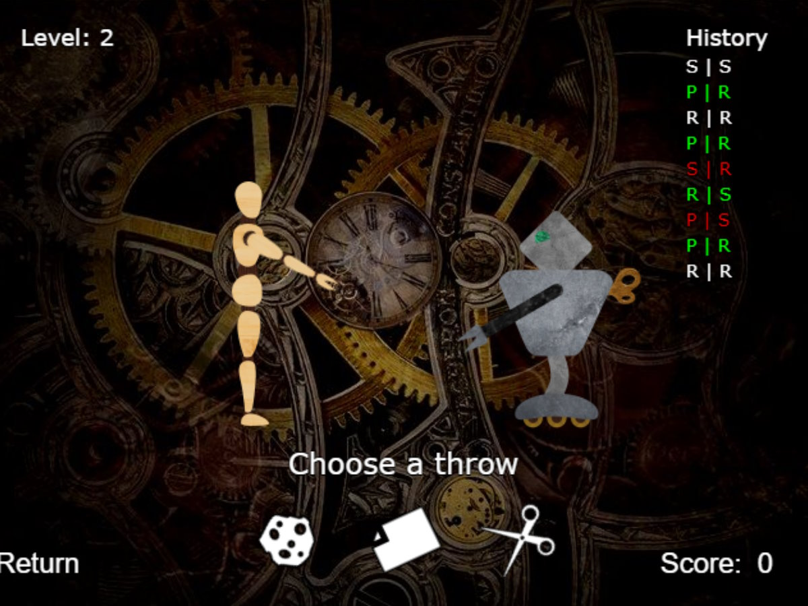

# Windup RPS

A game where you must play rock-paper-scissors against a group of evil (but no so smart) windup robots.

[Play the game here](https://jfmdev.github.io/windup-rps/)

## Getting Started

The project was created using the [vite-phaser-ts](https://github.com/iwantantra/vite-phaser-ts) template, which provides the following scripts:

* `npm run dev` to run the project locally.
* `npm run build` to build the project.
* `npm run preview` to preview the build.
* `npm run lint` to lint check your code using eslint.
* `npm run lint-fix` to lint check and fix your code.

## License

Windup RPS is free software; you can redistribute it and/or modify it under the terms of the Mozilla Public License v2.0. You should have received a copy of the MPL 2.0 along with this software, otherwise you can obtain one at http://mozilla.org/MPL/2.0/.